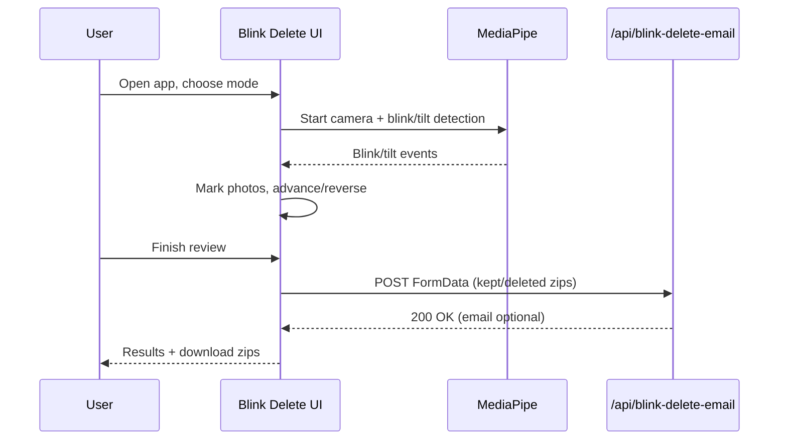

# Blink Delete (Day 2 of 30 Days of Product)

Eye-tracking photo review: blink to mark deletes; tilt to navigate.

## Live demo
- Visit https://lawrencehua.com/blink-delete

## Problem & Solution
- **Problem:** Reviewing large photo batches is tedious with keyboard/mouse.
- **Solution:** Hands-free blink-to-delete with tilt navigation; optional email of kept/deleted zips.

## What’s inside
- Standalone Next.js app with MediaPipe eye/tilt detection.
- JSZip + file-saver for local zips; `/api/blink-delete-email` for optional email via Resend.
- `.env.example` placeholders to fill with your own keys. 

## Run locally
1. Install deps: `npm install`
2. Copy `.env.example` to `.env` and provide your values
3. Start dev server: `npm run dev`
4. Open `http://localhost:3000`

## Notes
- For demos, use the live link above.
- Repo name: Blink Delete (Day 2 of 30 Days of Product)

## Architecture
```mermaid
flowchart TD
  U[User] --> UI[Next.js Blink Delete UI]
  UI --> CAM[Media stream + MediaPipe FaceMesh]
  UI --> DET[useBlinkDetection hook]
  DET --> ST[App state (hero/demo/upload/review/results)]
  UI --> ZIP[JSZip + file-saver]
  UI --> API[/api/blink-delete-email (Resend)]
```

## Sequence

